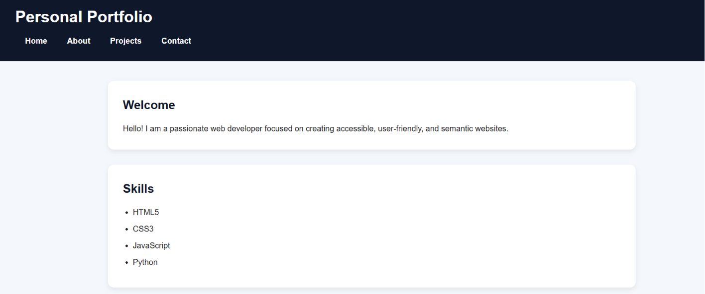
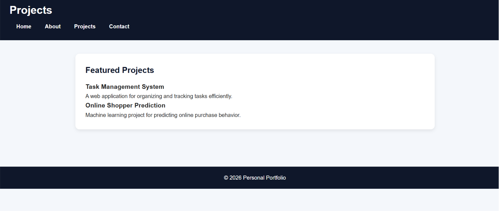
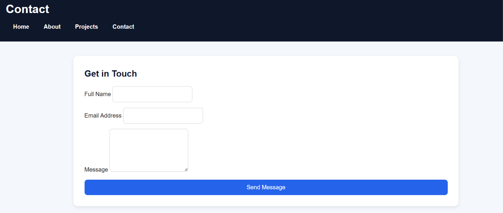
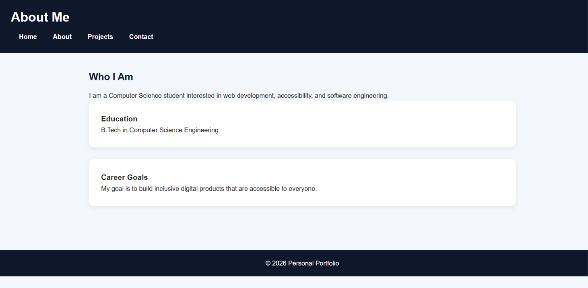

# 💼  Portfolio Website

A modern and responsive personal portfolio website built to showcase my skills, projects, education, and achievements. This website provides a professional online presence with a clean user interface and a seamless experience across all devices.

## 🚀 Live Demo

🔗 https://boisterous-eclair-98490f.netlify.app/

## 📖 About the Project

This portfolio website serves as a digital resume, highlighting my technical skills, projects, educational background, and contact information. The design is fully responsive and optimized for desktop, tablet, and mobile devices.

## ✨ Features

- Responsive design for all screen sizes
- Modern and clean user interface
- About Me section
- Skills showcase
- Project portfolio section
- Education and achievements section
- Contact information section
- Smooth navigation
- Mobile-friendly layout

## 🛠️ Technologies Used

- HTML5
- CSS3
- JavaScript

## 📁 Project Structure

```text
portfolio-website/
├── index.html
├── style.css
├── script.js
├── images/

```

## 🎯 Objectives

- Build a professional online portfolio
- Demonstrate frontend development skills
- Practice responsive web design
- Showcase projects and achievements
- Improve user interface and user experience design

## 📸 Screenshots

### Home Page


### Projects Section


### Contact Section


### About section



## 📚 Learning Outcomes

Through this project, I gained experience in:

- Responsive Web Design
- Frontend Development
- HTML Structure and Semantic Elements
- CSS Styling and Layout Techniques
- JavaScript Interactivity
- Website Deployment and Hosting
- Version Control using Git and GitHub

## 🔮 Future Enhancements

- Dark Mode Support
- Resume Download Feature
- Contact Form Integration
- Project Filtering Options
- Animations and Transitions
- Blog Section
- Backend Integration

## 🚀 Deployment

This project can be deployed using:

- Netlify
- GitHub Pages
- Vercel

## 🤝 Contributing

Contributions, suggestions, and feedback are welcome. Feel free to fork the repository and submit pull requests.

## 👩‍💻 Author

**Kanneboina Maheshwari**

GitHub: https://github.com/KanneboinaMaheshwari29/

LinkedIn: https://www.linkedin.com/in/maheshwari-kanneboina-91a374312

## ⭐ Support

If you found this project useful, consider giving it a star on GitHub.

---

Made with ❤️ using HTML, CSS, and JavaScript.